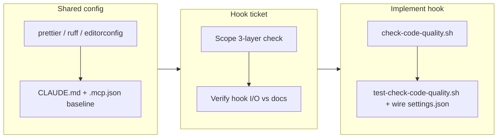

## 1. Overview

This branch equips the `standard-repository` template with a shared code-quality
baseline and an automated way to enforce it. It adds a language-agnostic
formatter/lint config (prettier, ruff, editorconfig) and a Claude Code
**PostToolUse** hook that checks every code-mutating action (`Edit`/`Write`/`MultiEdit`)
against the published handbook coding guideline. All of this ships together in
this single pull request.

**Highlights:**

1. Shared formatter/lint config: `.prettierrc.json`, `ruff.toml`, `.editorconfig` (plus the AI-tooling `CLAUDE.md` / `.mcp.json` baseline).
2. New `hooks.PostToolUse` (matcher `Edit|Write|MultiEdit`) in `.claude/settings.json`, delegating to a repo script.
3. `scripts/check-code-quality.sh` — three-layer check (prettier/ruff → guideline context → `/code-review` nudge) that never blocks a code action, with a runnable self-check (`scripts/test-check-code-quality.sh`, 7 assertions).

## 2. Motivation

The template had no shared quality bar and nothing that made an agent consult the
handbook guideline while writing code — conformance relied on memory. This branch
sets the bar (shared linter/formatter config) and enforces it automatically: a
PostToolUse hook fires after every edit. The hook is deliberately a thin entry
point that calls one repo script (per the command-scripts and ci-cd policies) so
the same check can later back CI, and it degrades to a clean no-op when tooling or
network is absent — essential for a template other projects are scaffolded from.

## 3. Changes

The branch first established a shared formatter/lint config, then scoped a ticket
for a hook that references the handbook guideline, verified the exact Claude Code
hook I/O contract against the official docs, and implemented the backing script,
its self-check, and the settings wiring on top of that config.

### 3-1. Shared formatter/lint config ([7be5e32](https://github.com/osbrjp/standard-repository/commit/7be5e32))

Added an agnostic base plus per-language config: `.editorconfig` (whitespace/indent),
`.prettierrc.json` (`printWidth: 100` for JS/TS/JSON/MD/…), and `ruff.toml`
(`line-length: 100` for Python), alongside the `CLAUDE.md` programming standard
and `.mcp.json` doc-server baseline. This is the quality bar the hook enforces.

### 3-2. Claude Code quality hook referencing the handbook guideline ([4870240](https://github.com/osbrjp/standard-repository/commit/4870240))

Added a PostToolUse hook and its backing script `scripts/check-code-quality.sh`
(prettier/ruff by extension when installed → handbook guideline injected as
`additionalContext` → `/code-review` nudge for substantial changes), wired via
`.claude/settings.json`, with `scripts/test-check-code-quality.sh` covering the
stdin→stdout contract. The hook exits 0 on any missing tool/parser/file, so it
never blocks an edit — safe in a fresh template with no toolchain yet.

## 4. Outcome

The template now carries both a shared quality bar and a per-action hook that
enforces it: the hook runs the shared prettier/ruff config when present, always
points Claude at the handbook guideline for a self-check, and escalates to
`/code-review` on larger changes. Verification was concrete: `settings.json`
parses as valid JSON, the self-check passes 7/7, a manual real-payload invocation
emits valid JSON containing the handbook URL, and the hook I/O contract was
confirmed against the official Claude Code docs.

## 5. Historical Analysis

No related historical context — this is the repository's first Claude Code hook
and its first client-side code-quality check. The shared config it builds on was
introduced earlier on this same branch.

## 6. Concerns

### Linters not yet installed in-tree

- **Severity:** low
- **Description:** Layer 1 only runs `prettier`/`ruff` when the binaries are present; the branch ships their config but not the toolchain, so Layer 1 no-ops until a project installs them (see [4870240](https://github.com/osbrjp/standard-repository/commit/4870240) in `scripts/check-code-quality.sh`).
- **How to Fix:** Document (or add) the expected toolchain install in the scaffolded project's setup, or add a devDependency / `pyproject` entry so `prettier`/`ruff` resolve.

### Layer 3 review nudge uses a fixed 80-line heuristic

- **Severity:** low
- **Description:** The "substantial change" trigger is a hard 80-line file threshold, which may be chatty on large files that received tiny edits (see [4870240](https://github.com/osbrjp/standard-repository/commit/4870240) in `scripts/check-code-quality.sh`).
- **How to Fix:** Base the trigger on the size of the change rather than the file, if a diff signal is available from the hook payload, or make the threshold configurable.

## 7. Successful Development Patterns

- Verifying the hook I/O contract against the official docs (via the claude-code-guide agent) *before* writing the script prevented guessing at the PostToolUse output schema — the `hookSpecificOutput.additionalContext` + exit-0 shape was confirmed, not assumed.
- Delegating a JSON payload's parse/emit to `python3` (with a presence guard) kept the shell script correct on escaping while still degrading to a clean no-op when the parser is absent — a thin, template-safe design.
- Writing a tiny stdin→stdout self-check (7 assertions, no framework) made the hook's contract runnable and gave the approval gate concrete, checkable evidence.

## 8. Release Preparation

**Verdict**: Ready for release

### 8-1. Concerns

- None that block release. The changes are config files plus two scripts and a `hooks` block in `.claude/settings.json` — no application code, no TODO/FIXME, no secrets, no failing checks.

### 8-2. Pre-release Instructions

- None — this PR (#32) targets `main` and carries the full set of changes.

### 8-3. Post-release Instructions

- None — standard process applies.

## 9. Notes

All changes ship in a single pull request (#32): the shared formatter/lint config
and the code-quality hook that enforces it against the handbook guideline.
